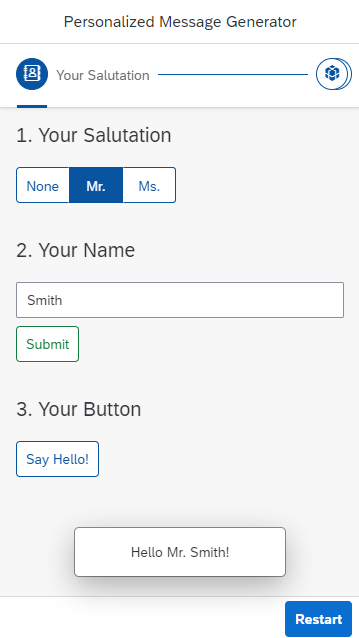

# Tutorial OpenUI5

Philipp Rall

---


## Prerequisites

To follow this tutorial you just need any IDE. I would recommend [Visual Studio Code](https://code.visualstudio.com/). To display the developed app make sure to install the extenstion "[LiveServer](https://marketplace.visualstudio.com/items?itemName=ritwickdey.LiveServer)", you should find it in the Visual Studio Code marketplace. The extension starts a local development server with live reload.  
Just right click the ```index.html``` and select "Open with Live Server".

For this tutorial, we start with a given folder structure, which already contains the basic files like ```index.html```, ```Component.js```, and ```Manifest.json``` as well as a basic view with its controller. You can find this basic project [here](demo/Start_of_Tutorial/)

Let's take a quick look at the existing files.

- The **```index.html```** file loads the OpenUI5 libraries from a Content Delivery Network (CDN), sets the theme, and namespace of the application (```se.openui5.helloworld```) and defines that the Component.js is loaded next.
- The **```Component.js```** file component only refers to the manifest and loads the root view specified in the ```Manifest.json```.
- The **```Manifest.json```** contains besides the root view some basic metadata like the title, version, or description of the application.

In this Tutorial, we want to implement a simple OpenUI5 App, which generates personalized "Hello"-Messages based on the selected salutation and the name of the user.

Here we go!

## 1. Display "Hello World!"

In the ```view``` folder we can find our primary view called ```App.view.xml``` (like the specified rootView in the ```Manifest.json```).
The initial ```App.view.xml``` should has the following content:  

in **webapp/view/App.view.xml**

```XML
<mvc:View
    controllerName="se.openui5.helloworld.controller.App"
    xmlns="sap.m"
    xmlns:mvc="sap.ui.core.mvc">

</mvc:View>
```

This piece of code just defines a new view and its corresponding controller which is in the controller folder of our application. Besides that, it references the default namespace ```sap.m``` (sap main) where most of the UI elements are located. So we don't need to write the prefix sap.m to include UI elements from this library. Moreover, we need to define the alias ```mvc``` for the namespace ```sap.ui.core.mvc``` where all Model-View-Controller assets are located.

Within the view, we can add our first UI element, a simple text element (from the sap.m library) with the text attribute "Hello World!".

in **webapp/view/App.view.xml**

```XML
<Text text="Hello World"/>
```

## 2. Create Controller with Button

Let's take a look on the corresponding controller of our view, which has initially the following content:

in **webapp/controller/App.controller.js (New)**

```JavaScript
sap.ui.define([
    "sap/ui/core/mvc/Controller"
], function (Controller) {
    "use strict";
    return Controller.extend("se.openui5.helloworld.controller.App", {

    });
});
```

With this controller, our app should already start and show "Hello World". That's the way how controllers in OpenUI5 look like, they always extend the generic OpenUI5 controller implementation. Within the return statement, we add our JavaScript Code.
For example, a method to show a "Hello World" message, which can be triggered by a button.

Updated file **webapp/controller/App.controller.js**

```JavaScript
sap.ui.define([
    "sap/ui/core/mvc/Controller",
    "sap/m/MessageToast"
], function (Controller, MessageToast) {
    "use strict";
    return Controller.extend("se.openui5.helloworld.controller.App", {
        onShowHello : function () {
            MessageToast.show("Hello World");
        }
    });
});
```

For showing texts in a so-called Message Toast we need to import the MessageToast from its namespace first. To achieve this we add ```"sap/m/MessageToast"``` to the define array at the beginning of the controller and ```MessageToast``` as a parameter of our function right after "Controller".
Be aware that all imports need to be handed over to the function by an identically sounding transfer parameter in the order of the imports.

We still want a button in our view, so let's replace our ```Text``` with a ```Button```. The dot a the beginning of the method name shows that the method is implemented in the corresponding controller.

in **webapp/view/App.view.xml**

```XML
<Button
    text="Show Hello World"
    press=".onShowHello"/>
```

## 3. Add shell, app, and page

To improve the appearance of our app, we want to add some UI components to our ```view```.
Let's add the following code surrounding our button.

in **webapp/view/App.view.xml**

```XML
<Shell>
    <App id="app">
        <Page title="Hello World app" titleAlignment="Center">

        </Page>
    </App>
</Shell>
```

Now our button is embedded in a shell (indentation left and right), an app, and a page with a centered page title.

## 4. Add margin to button

Besides that, the app would look better, if the button has a margin. Consequently, let's add one.
There are several predefined sapUi classes for padding/margin for example ```sapUiSmallMargin```, so we don't need to write a single line of CSS.
Instead of ```Small``` a margin can also be ```Tiny```, ```Medium``` or ```Large```, instead of a surrounding margin (like in the example) we can also add ```Top```, ```Bottom```, ```Begin``` or ```End``` at the end of the class name. For the padding CSS classes just replace margin by padding.

We add the class to our button by the ```class``` attribute:

in **webapp/view/App.view.xml**

```JavaScript
    class="sapUiSmallMargin"
```

## 5. Add Icon to button

To enhance the look of our button we want to add an icon to it.
SAP provides you an Icon Explorer with many free icons, which can be found [here](https://sapui5.netweaver.ondemand.com/test-resources/sap/m/demokit/iconExplorer/webapp/index.html#/overview/SAP-icons). Just select an icon there and copy its sap-icon code, for example, ```sap-icon://sap-ui5```.

For adding icons we need to specify the ```icon``` attribute in our button:

in **webapp/view/App.view.xml**

```JavaScript
    icon="sap-icon://sap-ui5"
```

## 6. Introduction to i18n

In this step, we want to introduce the internationalization feature of OpenUI5 into our app.
For that, we need to create an ```i18n``` folder with an ```i18n.properties``` file. It's called ```i18n``` because there are the 18 characters between the 'i' and the 'n of the word internationalization.
Let's add the following key-value pairs to our file (# makes a comment), keys should be in lowerCamelCase:

in **webapp/i18n/i18n.properties (New)**

```XML
#General
title=Demo App

#Buttons
buttonText=Say Hello
```

In this tutorial, we just create one i18n file to show how the concept works, in a real application there would be several files postfixed by the respective language, e.g. ```i18n_de.properties```. Depending on the default language of the browser, the corresponding file is selected automatically. Just try it out!

To access our translated texts we need a ```ResourceModel```. Since it should apply to the "entire" application we define our model in the ```Component.js```.

Updated file: **webapp/Component.js**

```JavaScript
sap.ui.define([
    "sap/ui/core/UIComponent",
    "sap/ui/model/resource/ResourceModel"
    ], function (UIComponent, ResourceModel) {
        "use strict";
        return UIComponent.extend("se.openui5.helloworld.Component", {

            metadata : {
                manifest: "json"
            },

            init : function () {
                UIComponent.prototype.init.apply(this, arguments);
                var i18nModel = new ResourceModel({
                    bundleName: "se.openui5.helloworld.i18n.i18n"
                });
                this.setModel(i18nModel, "i18n");
            }
        });

    });
```

After importing the ```ResourceModel``` from its namespace we instantiate a new model and set the ```bundleName``` to our i18n file (base file). In the last step, we set the created model as a named model with the key "i18n".

Next, we have to use our model in our view. We can access the model by its key "i18n" followed by a ">" and the key of the text we want to receive.
Let's adopt the page title and button text.

in **webapp/view/App.view.xml**

```JavaScript
title="{i18n>title}"

text="{i18n>buttonText}"
```

From now on, all UI texts will follow this way.

## 7. Implement Wizard with three WizardSteps (with icons) in View

Normally we implement a business use case with OpenUI5 and need to find a suitable UI layout for this use case.
In our example we want to implement the personalization process of a hello message, this process consists of three steps: Firstly, the selection of the salutation (None/Mr./Ms.). Secondly, the input of the user's name and lastly the generated button.
If we take a look at the Fiori design guidelines, we notice that the [Wizard Floorplan](https://experience.sap.com/fiori-design-web/wizard/) perfectly fits our requirements. The floorplan description links also the [documentation](https://sapui5.hana.ondemand.com/#/api/sap.m.Wizard%23controlProperties) and some [samples](https://sapui5.hana.ondemand.com/#/entity/sap.m.Wizard/sample/sap.m.sample.Wizard) of the Wizard control in OpenUI5 at the bottom of the page.

With this information, we can implement the control inside our ```Page``` as follows.

in **webapp/view/App.view.xml**

```XML
    <Wizard id="myWizard">
        <WizardStep title="{i18n>salutation}" icon="sap-icon://customer-briefing">
        </WizardStep>
        <WizardStep title="{i18n>name}" icon="sap-icon://database">
        </WizardStep>
        <WizardStep title="{i18n>button}" icon="sap-icon://sap-ui5">
        </WizardStep>
    </Wizard>
```

In doing so we receive three wizard steps with titles and icons. Also, we need to update our i18n file with the appropriate values.

in **webapp/i18n/i18n.properties**

```XML
#Steps
salutation=Your Salutation
name=Your Name
button=Your Button
```

## 8. Move the existing button in the third step

Now we have to fill our wizard steps with some content. So let's start with the third step and move our existing button inside the third wizard step.

## 9. Add Segmented Buttons in the First Step

In the first step, the user should be able to choose between three salutations: "None", "Mr." and "Ms."
This use cases could be realized by a [SegmentedButton](https://openui5.hana.ondemand.com/api/sap.m.SegmentedButton). As we want the user to explicitly choose a salutation we set the ```selectedItem``` attribute to "None".

in **webapp/view/App.view.xml**

```XML
<SegmentedButton id="mySegmentedButtons" selectedItem="None">
    <items>
        <SegmentedButtonItem text="{i18n>noSalutation}"/>
        <SegmentedButtonItem text="{i18n>mrSalutation}"/>
        <SegmentedButtonItem text="{i18n>msSalutation}"/>
    </items>
</SegmentedButton>
```

in **webapp/i18n/i18n.properties**

```XML
#Salutations
noSalutation=None
mrSalutation=Mr.
msSalutation=Ms.
```

## 10.  Add Input field and button in the Second Step

Only the content of our second step is still missing, so let's add there an input field with a placeholder for the user's name and a button to submit the input. We set the button ```type``` to "Accept" so it's shown green. The "onSubmitName" method is not implemented yet, we will add this method later.

in **webapp/view/App.view.xml**

```XML
<Input placeholder="{i18n>namePlaceholder}"/>
<Button text="{i18n>submit}" type="Accept" press=".onSubmitName"/>
```

in **webapp/i18n/i18n.properties**

```XML
#Buttons
submit=Submit

#Placeholder
namePlaceholder=Please enter your name!
```

## 11.  Introduce JSON Model, connect the input field with the model

To use the user inputs for our personalized hello message, we need to connect the UI elements to a data model.
For our example, we can use a simple client-side JSON model, which needs to be defined in the ```Component.js``` like the ResourceModel.

Updated file: **webapp/Component.js**

```JavaScript
sap.ui.define([
    "sap/ui/core/UIComponent",
    "sap/ui/model/json/JSONModel",
    "sap/ui/model/resource/ResourceModel"
], function (UIComponent, JSONModel, ResourceModel) {
    "use strict";

    return UIComponent.extend("se.openui5.helloworld.Component", {

        metadata : {
            manifest: "json"
        },

        init : function () {
            UIComponent.prototype.init.apply(this, arguments);

            var oDataModel = {
                salutation: "",
                name: ""
            };
            var oJSONModel = new JSONModel(oDataModel);
            this.setModel(oJSONModel);

            var i18nModel = new ResourceModel({
                bundleName: "se.openui5.helloworld.i18n.i18n"
            });
            this.setModel(i18nModel, "i18n");
        }
    });
});
```

We instantiate a new ```JSONModel``` from a simple object and set it to our views. This time we don't set a key for our model, therefore it's an unnamed model. You can only have one unnamed model.

Now we can bind the value of our input field to our JSON model by adding the ```value``` attribute to our Input element. We access the value of our model in this case by a "/" followed by the path of the value. In the case of a named model, you should prefix this expression by the model's key followed by a ">" (like the access to the i18n model).

in **webapp/view/App.view.xml**

```XML
value="{/name}"
```

In the following steps, we need to further implement the controller of our application to receive and validate the user's inputs and generate the personalized message.

## 12.  Write onInit Function of Controller (empty)

Firstly, we add the ```onInit``` function which is a lifecycle function that is called upon the initialization of the view.
In the following implementation of our controller, we will need some variables often. To reduce code redundancy it's good practice to define them in the ```onInit``` function.  
We store the view object received by ```this.getView()``` in a variable as well as our JSONModel and our wizard.
Note that all functions are separated by commas!

in **webapp/controller/App.controller.js**

```JavaScript
onInit : function (){
    this._oView = this.getView();
    this._oModel = this._oView.getModel();
    this._oWizard = this._oView.byId("myWizard");
},
```

As you can see in the code, UI elements are accessed by the view object and their ID.
It's a convention to follow the Hungarian notation for identifier, the prefix "_o" stands for a private object (only used inside the controller).

## 13. Remove ShowNext Button

To make our wizard more user-friendly, we remove the next step buttons. In the future, the next step will be selected automatically when the user action of the current step is completed.
So, just add the following attribute to our wizard.

```JavaScript
showNextButton="false"
```

In the coming functions, we just need to call the ```nextStep()``` method of our wizard object to select the next step. You can find this information as always in the detailed [OpenUI5 documentation](https://openui5.hana.ondemand.com/api/sap.m.Wizard#methods/nextStep).

## 14.  Write onChangeSelection function in Controller

As you may have noticed, we are currently not storing the selection of our SegmentedButton for the salutation in our JSONModel.
Let's change that.

Therefore, we need to implement an ```onChangeSelection``` function, which should be called when the selection of the SegmentedButton changes.
To achieve that, we add the ```selectionChange``` event to our SegmentedButtons.

in **webapp/view/App.view.xml**

```JavaScript
selectionChange=".onSelectionChanged"
```

After that, we implement the function in the controller. Based on the passing parameter ```oEvent```, we get the selected text and store it, if it is not "None", in our JSON model.
Once saved our input, we will proceed to the next step of the wizard by calling the ```nextStep()``` method.

in **webapp/controller/App.controller.js**

```JavaScript
onSelectionChanged : function (oEvent) {
    var sSelectedValue = oEvent.getParameter("item").getText();

    if(sSelectedValue!="None"){
        this._oModel.setProperty("/salutation", sSelectedValue);
    }else{
        this._oModel.setProperty("/salutation", "");
    }
    this._oWizard.nextStep();
}
```

In this example, we can see how to work with JSON models.
To change a property we can use the ```setProperty()``` method, to receive a value the ```getProperty()``` method. Both methods need the path of our value which is introduced by a slash.
If you want to get more information about the methods of a JSON model, it's worth taking a quick look at the [documentation](https://openui5.hana.ondemand.com/api/sap.ui.model.json.JSONModel#methods).

Now the selected salutation is always stored in our JSON model.

## 15.  Write onSubmitName function in Controller

The salutation could be empty, but every Say-Hello-Message needs a name.
That's the reason why we should add a validator for our input field. As we already added a ```press``` event to our Submit button, we can directly implement the ```onSubmitName``` function.
If the current value of the name is an empty string, we want to show a message and don't go over to the next step. For the message, we use the already known MessageToast.

in **webapp/controller/App.controller.js**

```JavaScript
onSubmitName : function () {
    if(this._oModel.getProperty("/name") !== ""){
        this._oWizard.nextStep();
    }else{
        MessageToast.show("Please enter a name!");
    }
}
```

## 16. Adjust onShowHello function

Finally, we only need to enrich the output of the ```onShowHello``` method with the data received during the wizard such as selected salutation and name.

```JavaScript
onShowHello : function () {
    MessageToast.show("Hello "+ this._oModel.getProperty("/salutation") + " " + this._oModel.getProperty("/name") + "!");
}
```

## 17. That's it!

We did it, we created our own personalized say hello message wizard.  You can find the final implementation [here](Solution%20%of%20Tutorial/webapp).

To get an impression of the inbox-responsiveness of an OpenUI5 it is worth having a look at our app in the mobile device simulation of the Chrome DevTools. As can be seen on the screenshot, for instance, the wizard is displayed in an adapted form on mobile devices.



If you want to add a restart button as displayed in the screenshot, just follow the next two steps.

## Bonus 18. Add footer with a restart button to the view

Firstly, we add a footer to our view. Therefore, we need to introduce two aggregations to separate our actual content from the footer.
As we can extract the [documentation](https://openui5.hana.ondemand.com/api/sap.m.Page#aggregations), for this purpose our ```Page``` has a ```content``` aggregation in which we put the existing code and a ```footer``` aggregation.
Aggregations simply represent has-a or is-a-part-of relationships between controls in OpenUI5 and always have a cardinality like 0..n or 0..1. To give you an example of cardinalities, a page has zero to many contents, but only zero to one footer.

In the footer, we add a toolbar and a button for restarting the wizard. To align our button right we use a ToolbarSpacer.

in **webapp/view/App.view.xml**

```XML
<content>
...
</content>
<footer>
    <Toolbar>
        <ToolbarSpacer/>
        <Button type="Emphasized" text="{i18n>restart}" press=".onRestart"/>
    </Toolbar>
</footer>
```

As you may have noticed, we need to extend the ```i18n.properties``` file by a restart text.

in **webapp/i18n/i18n.properties**

```XML
restart=Restart
```

## Bonus 19. Implement onRestart function in Controller

In the final step, we implement the ```onRestart``` function which is called by the ```press``` event of our restart button.
In case of a restart, we want to discard the progress of our wizard and set the wizard the first step (which is in a null based array of the steps the 0th element).
After that, we clear the JSONModel and reset the segmentedButton.

in **webapp/controller/App.controller.js**

```JavaScript
onRestart : function () {
    this._oWizard.discardProgress(this._oWizard.getSteps()[0]);
    this._oModel.setProperty("/salutation", "");
    this._oModel.setProperty("/name", "");

    this._oView.byId("mySegmentedButtons").setSelectedItem("None");
}
```
